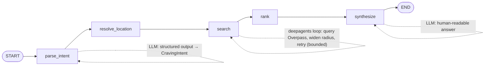

# Anything Finder

Experimenting with modern, novel tooling to find stuff to do near me in response to Google's AI search which makes searching for things to do near me much more difficult.

The first capability is an **AI restaurant search**: send a natural-language request
(e.g. _"quiet sushi near Grandscape in The Colony, TX"_) and an agentic workflow geocodes
the location, searches OpenStreetMap for matching eateries, ranks them, and writes back a
human-readable recommendation.

---

## Infrastructure architecture

The app is a FastAPI service that depends on four external components. Every dependency is
**reached over HTTP via an env-configurable URL**, so each one can be swapped between a local
container, an in-cluster Kubernetes service, or a hosted/public API without code changes.

```
                         ┌──────────────────────────┐
   natural-language ───► │   anything-finder (API)  │
   request              │   FastAPI + LangGraph    │
                         └───┬───────┬───────┬──────┘
                             │       │       │
        geocoding ┌──────────┘       │       └──────────┐ conversation state
                  ▼                  ▼                  ▼
            ┌───────────┐     ┌────────────┐     ┌────────────┐
            │ Nominatim │     │  Overpass  │     │ PostgreSQL │
            │ (geocode) │     │ (OSM POIs) │     │ checkpoint │
            └───────────┘     └────────────┘     └────────────┘
                  │
                  ▼  inference (OpenAI-compatible)
            ┌───────────┐
            │   vLLM    │  self-hosted Qwen on a 16 GB GPU (e.g. RTX 5060 Ti)
            └───────────┘
```

| Component | Purpose | What you can change |
| --- | --- | --- |
| **vLLM** | Serves the LLM behind an OpenAI-compatible API. Default model is a ~7B quantized Qwen (`Qwen/Qwen2.5-7B-Instruct-AWQ`) sized for a 16 GB GPU. | `LLM_BASE_URL`, `LLM_MODEL`, and per-role overrides (`LLM_MODEL_INTENT` / `LLM_MODEL_SEARCH` / `LLM_MODEL_SYNTHESIZE`). Swap in any model your GPU can serve, or point at a hosted OpenAI-compatible endpoint. |
| **Nominatim** | Forward/reverse geocoding (place name ↔ coordinates). | `NOMINATIM_BASE_URL`, or the `NOMINATIM_USE_EXTERNAL_API` / `NOMINATIM_USE_KUBERNETES_WITH_GEOSEARCH_NAMESPACE` toggles to pick public vs. in-cluster defaults. |
| **Overpass** | Queries OpenStreetMap for nearby eateries. | `OVERPASS_BASE_URL`, or the equivalent `OVERPASS_USE_*` toggles. |
| **PostgreSQL** | LangGraph checkpointer — persists conversation/session state, shared across replicas. | `POSTGRES_DSN`. |

### Deployment expectations

- Designed for a **self-hosted Kubernetes cluster** where vLLM, Nominatim, Overpass, and
  Postgres run as in-cluster services (the default URLs resolve `*.svc.cluster.local`).
- Because state lives in Postgres (not in-process), the API is **horizontally scalable** —
  run multiple replicas behind a service; a given `session_id` maps to a checkpointer
  `thread_id` so conversations are consistent across pods.
- The container image is built from `containerfile` (multistage, pipenv `--deploy`, non-root
  user). `APP_IP`/`APP_PORT` default to `0.0.0.0:9022` in the image.
- For **local development** you can flip the `*_USE_EXTERNAL_API` flags to `true` to hit the
  public Nominatim/Overpass APIs and run Postgres + vLLM locally (or point `LLM_BASE_URL` at
  any OpenAI-compatible server).

---

## AI agent workflow architecture

A **hybrid LangGraph workflow** compiled once at startup: a deterministic backbone with a
single bounded **deepagents** tool-loop for the open-ended search/widen step. The LLM is used
at three points (intent extraction, the search loop, and final synthesis); geocoding, ranking,
and bounding-box math stay deterministic for predictable latency and cost.



| Node | Type | Responsibility |
| --- | --- | --- |
| `parse_intent` | LLM | Extracts a structured `CravingIntent` (craving, vibe, location phrase) from the raw query via `with_structured_output(method="json_schema")` (vLLM guided decoding). |
| `resolve_location` | deterministic | Uses caller-supplied coordinates if present, otherwise forward-geocodes the location phrase through Nominatim. |
| `search` | deepagents | A `create_deep_agent` tool-loop that calls Overpass, and **widens the radius and retries** when results are sparse — bounded by a recursion limit and a hard max radius. |
| `rank` | deterministic | Scores candidates by category match + haversine proximity. |
| `synthesize` | LLM | Writes the final recommendation from the ranked shortlist. |

### Key design points

- **Dependencies are closure-bound into node factories** (`make_*_node(...)`) at compile time,
  never stored in graph state. The state is serialized by the Postgres checkpointer, so it
  must stay JSON-serializable — clients and LLMs must not live in it.
- **Per-role models**: each LLM node can be backed by a different served model, all from one
  vLLM endpoint, configured purely through env vars.
- **Prompts live in markdown** under `src/agents/geo_search/prompts/`, loaded via
  `src/utils/prompts.py` — never inlined in source.

### Relevant source

| Path | Contents |
| --- | --- |
| `src/agents/geo_search/graph.py` | `compile_geo_graph(...)` — node wiring + checkpointer. |
| `src/agents/geo_search/nodes.py` | The node factories and the deepagents search loop. |
| `src/agents/geo_search/state.py` | `GeoSearchState` (the serialized graph state). |
| `src/agents/geo_search/prompts/` | Markdown prompt templates. |
| `src/utils/{llm,nominatim,overpass,prompts}.py` | Client factories + helpers. |
| `src/routers/geo_search/restaurants.py` | The HTTP endpoint. |

---

## Installation & startup

### Requirements

- Python **3.12**
- [`pipenv`](https://pipenv.pypa.io/) for dependency management
- Reachable **Postgres**, **Nominatim**, **Overpass**, and a **vLLM** (or other
  OpenAI-compatible) endpoint — see the table above

### Install

```bash
pipenv install --dev      # create the virtualenv and install deps
cp .env.example .env       # then edit values for your environment
```

Dependencies are managed in `Pipfile`; `pyproject.toml` is kept in sync via
`scripts/sync_pyproject.py`. Use the Makefile rather than editing by hand:

```bash
make add pkg="some-package>=1.2"     # runtime dep (also syncs pyproject.toml)
make add-dev pkg="pytest-cov"        # dev-only dep
make remove pkg=some-package
make install                         # pipenv install --deploy (CI/prod)
```

### Configure

All configuration is environment-driven; `.env.example` documents every variable. The ones
you'll most likely change first:

- `LLM_BASE_URL` / `LLM_MODEL` — where your vLLM lives and which model it serves
- `POSTGRES_DSN` — checkpointer database
- `NOMINATIM_*` / `OVERPASS_*` — geocoding + POI endpoints (toggle external vs. in-cluster)

### Run

```bash
make dev                 # uvicorn with --reload on 127.0.0.1:9022
# or directly:
pipenv run python -m src.main
```

Health check and example request:

```bash
curl localhost:9022/health
# {"status":"healthy"}

curl -X POST localhost:9022/api/geo-search/restaurants/user-123 \
  -H 'content-type: application/json' \
  -d '{"query":"quiet sushi near Grandscape in The Colony, TX","include_casual":false}'
```

Pass `latitude`+`longitude` (or `city`+`state`) to override the location instead of letting
the agent geocode the phrase from the query. Provide a `session_id` to continue a prior
conversation (it maps to the checkpointer thread).

### Test

The default suite is **hermetic** — it stubs the LLM, mocks HTTP (`pytest-httpx`), and uses an
in-memory checkpointer, so it needs no GPU, database, or network:

```bash
pipenv run pytest                 # runs everything except @pytest.mark.live
pipenv run pytest -m live         # opt-in: requires a real vLLM + Postgres
```

Layout: `tests/unit/` mirrors `src/`, and `tests/regression/` holds schema-stability guards.

### Container

```bash
podman build -t anything-finder -f containerfile .   # or docker build
podman run --env-file .env -p 9022:9022 anything-finder
```
