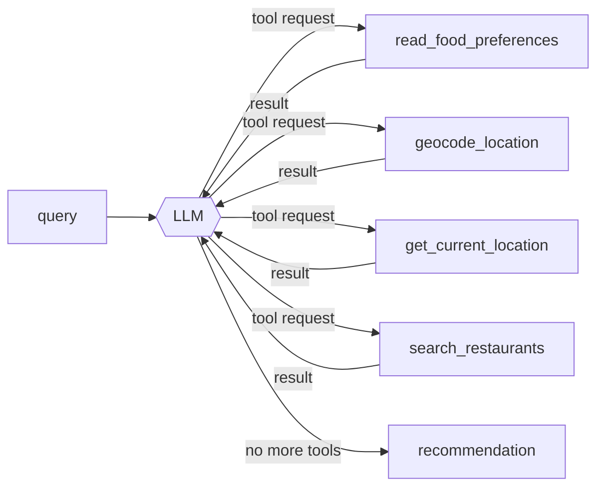

# Anything Finder

Agentic search for things to do near you — a counter to general-web AI search that
increasingly buries local results. The first capability is an **AI restaurant search**:
send a natural-language request and an LLM agent geocodes the location, searches
OpenStreetMap for matching eateries, and writes back a short, human recommendation.

```
POST /api/geo-search/restaurants/{user_id}
{ "query": "quiet sushi in Deep Ellum, Dallas" }

→ "Deep Ellum has a couple of solid quiet sushi options — try Deep Sushi for a
   calm room and fresh nigiri, or …"
```

Everything the agent does is captured as a **telemetry trace** you can query and
replay from a local console (`make trace`).

---

## Quick start (full local stack)

The compose file brings up the API plus every dependency (Postgres, Nominatim,
Overpass, an OSM file server) against a **Dallas** OpenStreetMap extract.

```bash
# 1. put the Dallas OSM extract in data/  (see scripts/osm_prepare.py + compose.claude.yaml)
#    data/Dallas.osm.pbf and data/Dallas.osm.gz
make osm-convert                       # gz → data/Dallas.osm.bz2 (Overpass import format)

# 2. provide an Anthropic key  (compose.claude.yaml runs LLM_BACKEND=claude;
#    put it in .env or export it — compose reads both)
export ANTHROPIC_API_KEY=sk-ant-...

# 3. bring it up
docker compose -f compose.claude.yaml up -d

curl -fsS localhost:9022/health                     # {"status":"healthy"}
curl -s localhost:9022/meta                         # {"backend":"claude","model":"…","mode":"claude",…}
```

> First boot builds the Nominatim and Overpass databases from the extract — that
> takes several minutes and needs headroom (give Docker/Colima ~8 GB RAM).

Then query it:

```bash
curl -sS -X POST localhost:9022/api/geo-search/restaurants/00000000-0000-0000-0000-000000000001 \
  -H 'content-type: application/json' \
  -d '{"query":"date-night Italian in Uptown, Dallas"}'
```

Or use the console — `make trace` — to submit queries and inspect each run.

---

## The API

### `POST /api/geo-search/restaurants/{user_id}`

`user_id` is a UUID used only to load an optional preferences file
(`data/preferences/<user_id>.md` — dietary restrictions, favourite cuisines,
dislikes). It does not need to be unique per person.

Request body (`GeoLocationRestaurantSearchRequest`):

| field | type | notes |
| --- | --- | --- |
| `query` | string, **required** | Natural-language request. Craving, vibe, and any location phrase are read from this text. |
| `session_id` | string | Conversation id → checkpointer `thread_id` for multi-turn. Falls back to `user_id`. |
| `city`, `state` | string | Location override. Coordinates are derived from them. Cannot be combined with `latitude`/`longitude`. |
| `latitude`, `longitude` | float | Explicit coordinate override (both required together). Cannot be combined with `city`/`state`. |
| `radius_m` | int | Starting search radius; a default is applied otherwise. |
| `include_casual` | bool | Widen beyond sit-down restaurants to cafés, fast food, bars, pubs. Default `false`. |

Response: `{ "response": "<recommendation text>" }`.

If no location override is given, the agent extracts and geocodes the location
from the `query` text. **The bundled data is Dallas-only** — queries must
reference Dallas-area places (Deep Ellum, Uptown, Bishop Arts, …).

### `GET /health` → `{"status":"healthy"}`
### `GET /meta` → `{"backend","model","mode","trace_enabled"}` — which model stack is serving requests.

---

## Telemetry console — `make trace`

A small FastAPI app (`scripts/trace_ui.py` + `trace_ui.html`, no extra deps) that
**queries the agent and lets you drill into what happened**. Needs the API
running (`make dev` or docker compose), which is where traces are written.

```bash
make dev                       # terminal 1 — API on :9022, AF_TRACE_DIR set
make trace                     # terminal 2 — console on :7861
```

What it gives you:

- **＋ New run** composer — submit a query; `session_id` auto-fills with a random
  UUID (regenerate with ↻). While the agent runs, the trace streams in live.
- **Runs sidebar** — every past run, grouped by **mode** (`claude` /
  `raw-open-source` / `finetuned-open-source`), each card badged with the model
  it used. Hover for an **×** to delete.
- **Conversation view** — the run rebuilt as numbered steps. Each tool the model
  calls is shown as a round-trip:

  ```
  ① arguments the model generated   →   ② your app runs the tool   →   ③ result handed back
  ```

  Argument values that came straight out of an earlier tool's result are tagged
  `↑ from geocode_location (step 1)`, so the data flow is visible. A collapsible
  primer explains that the model only emits tool *requests* — your app executes
  them.
- **Stats tab** — token bars (input / output / cache), cost estimate, calls per
  run, per-mode aggregates.

### Where traces are saved

Set `AF_TRACE_DIR` on the **API** process and every agent run writes one JSON file:

```
<AF_TRACE_DIR>/<mode>/<YYYYMMDD-HHMMSS>-<trace_id>.json
```

`mode` comes from `AF_TRACE_MODE`, else derived from `LLM_BACKEND`
(`claude` → `claude`, `vllm` → `raw-open-source`, `lora` →
`finetuned-open-source`). Each file holds ordered spans (one per LLM call, one
per tool call) with inputs, outputs, token usage, cost, timing, and the
structured request. `make dev` and `compose.claude.yaml` set `AF_TRACE_DIR`
automatically (`./telemetry/`, git-ignored). Implementation: `src/utils/telemetry.py`.

---

## Architecture

### The agent

A single **deepagents** tool-loop, compiled once at startup
(`src/agents/geo_search/agent.py`), backed by the Postgres checkpointer for
multi-turn state. The system prompt lives in `prompts/restaurant_agent.md` (never
inline in source).



| Tool | Does |
| --- | --- |
| `read_food_preferences` | Reads `data/preferences/<user_id>.md` if present. |
| `geocode_location` | Place phrase → coordinates via **Nominatim**. |
| `get_current_location` | Falls back to `HOME_CITY`/`HOME_STATE` (Dallas, TX) when no location is mentioned. |
| `search_restaurants` | Queries **Overpass** for eateries near `(lat, lon)` within `radius_m`; the model widens the radius and retries when results are sparse (hard cap 16 km, 10 results). |

`src/services/geo_search/restaurants.py` builds the agent input from the request,
runs the loop, and extracts the final assistant message. Tools are
closure-bound to their HTTP clients at compile time — never stored in graph
state (the state is JSON-serialized by the checkpointer).

### Infrastructure

The API is a FastAPI service; every dependency is reached over HTTP at an
**env-configurable URL**, so each can be a local container, an in-cluster
Kubernetes service, or a hosted API without code changes.

```
   natural-language request
             │
             ▼
   ┌──────────────────────┐      ┌───────────┐  place ↔ coords
   │  anything-finder API │────► │ Nominatim │
   │  FastAPI + deepagents│      └───────────┘
   │                      │      ┌───────────┐  nearby OSM eateries
   │                      │────► │  Overpass │
   │                      │      └───────────┘
   │                      │      ┌───────────┐  conversation state
   │                      │────► │ PostgreSQL│  (LangGraph checkpointer)
   │                      │      └───────────┘
   │                      │      ┌───────────┐  inference
   │                      │────► │ LLM backend│  vLLM / Anthropic / LoRA
   └──────────────────────┘      └───────────┘
```

| Component | Purpose | Key env |
| --- | --- | --- |
| **LLM backend** | Inference. See below. | `LLM_BACKEND`, `LLM_MODEL*`, `LLM_BASE_URL`, `ANTHROPIC_API_KEY` |
| **Nominatim** | Forward geocoding (place ↔ coordinates). | `NOMINATIM_BASE_URL`, or `NOMINATIM_USE_EXTERNAL_API` / `NOMINATIM_USE_KUBERNETES_WITH_GEOSEARCH_NAMESPACE` |
| **Overpass** | OpenStreetMap POI queries. | `OVERPASS_BASE_URL`, or the matching `OVERPASS_USE_*` toggles |
| **PostgreSQL** | LangGraph checkpointer — session state, shared across replicas. | `POSTGRES_DSN` |

Because state lives in Postgres, the API is **horizontally scalable** — run
several replicas behind a service; a `session_id` maps to a checkpointer
`thread_id` so multi-turn conversations stay consistent across pods.

### LLM backends

`LLM_BACKEND` selects the provider (`src/utils/llm.py`); all read shared
`LLM_TEMPERATURE`, `LLM_TIMEOUT_SECONDS`, `LLM_MAX_RETRIES` and support per-role
overrides (`LLM_MODEL_AGENT`, `LLM_TEMPERATURE_AGENT`, …).

| `LLM_BACKEND` | Uses | Needs |
| --- | --- | --- |
| `vllm` *(default)* | Self-hosted vLLM / any OpenAI-compatible server. | `LLM_BASE_URL`, `LLM_MODEL` (default a ~7B quantized Qwen for a 16 GB GPU), `LLM_API_KEY` |
| `claude` | Anthropic API (`langchain-anthropic`). | `ANTHROPIC_API_KEY`, `LLM_MODEL_CLAUDE` (default `claude-sonnet-4-6`) |
| `lora` | Same vLLM endpoint with a trained LoRA adapter. | `LLM_MODEL_LORA` (served adapter name, e.g. `af-lora`, or an HF repo path) |

---

## Fine-tuning on brev.dev

Distil the captured Claude tool-calling trajectories
(`data/eval/*_runs.jsonl`, produced by `make eval-run`) into a LoRA adapter for
`Qwen/Qwen3.8-27B`, then serve it on the FP8 repo in vLLM.

The torch-free pipeline logic lives in `src/training/` (hermetically tested under
`tests/unit/training/`); `scripts/` holds the thin CLIs. The training stack is a
separate dependency group, kept out of the container:

```bash
# 1. Build the SFT dataset (hermetic, no GPU):
make lora-data                       # -> data/lora/{train,val}.jsonl + tool_schemas.json
make lora-smoke                      # dry-run: inspect the masked example (system/user/
                                     # tool spans masked; every assistant turn trained)

# 2. On a GPU box (>= 48 GB VRAM for the 27B QLoRA run):
git clone <repo> && cd anything-finder
HF_TOKEN=hf_... bash scripts/brev_setup.sh     # nvidia-smi check, uv, uv sync --group training
uv run scripts/train_lora.py --config configs/lora/smoke.yaml    # cheap GPU-path check first
make lora-train                                                  # the real run
#   overrides: make lora-train ARGS="--set train.learning_rate=5e-5"
#   multi-GPU: accelerate launch scripts/train_lora.py --config configs/lora/qwen3_8-27b-qlora.yaml
```

Notes:

- **Base-model constraint.** `Qwen/Qwen3.8-27B-FP8` cannot be LoRA-trained (no
  backprop through FP8 block-quantized weights). Train on the BF16 repo with
  4-bit QLoRA; serve the adapter on the FP8 repo. vLLM keeps adapters in BF16 and
  supports this — there is a small train/serve distribution mismatch; serving
  `Qwen/Qwen3.8-27B` (one-line `VLLM_MODEL` change) removes it at the cost of VRAM.
- The 27B is multimodal; `configs/lora/*.yaml` `lora.exclude_modules` keeps the
  vision tower frozen. `scripts/train_lora.py` logs the adapted module list after
  `get_peft_model` so an exclude-pattern miss is visible immediately.
- Only 70 of the 86 captured runs are usable (16 carry geocoding errors). To grow
  the set: bring the compose geo stack up so Nominatim has the full Dallas import,
  then `make eval-run-sonnet ARGS="--resume"` across all 200 rows
  (`scripts/gen_eval_queries.py` takes `--rows` / `--seed`). `make lora-data`
  takes a repeatable `--input` glob so new run files merge in.
- **Serve:** uncomment the `vllm` service in `compose.claude.yaml`, then
  `LLM_BACKEND=lora LLM_MODEL_LORA=af-lora LLM_BASE_URL=http://vllm:8000/v1`.
  `GET /meta` reports `{"backend":"lora","mode":"finetuned-open-source"}`;
  `make trace` files the run under `finetuned-open-source/` for a span-for-span
  comparison against `claude/`.

---

## Local development

Dependencies are managed with **[uv](https://docs.astral.sh/uv/)** (`uv.lock` is
the lockfile; `pyproject.toml` holds the deps and the `dev` dependency-group).

```bash
uv sync                       # create .venv and install everything (incl. dev)
cp .env.example .env          # then edit for your setup

make dev                      # uvicorn --reload on 127.0.0.1:9022 (AF_TRACE_DIR=telemetry)
# or: uv run python -m src.main

uv add "some-package>=1.2"     # add a runtime dep
```

Config is entirely environment-driven; `.env.example` documents every variable.
`make dev` reads a sourced `.env`; `docker compose` picks up `.env` automatically.
The ones you'll touch first: `LLM_BACKEND` (+ its credentials), `POSTGRES_DSN`,
`NOMINATIM_*` / `OVERPASS_*`.

### Tests

The default suite is **hermetic** — it stubs the LLM, mocks HTTP
(`pytest-httpx`), and uses an in-memory checkpointer, so it needs no GPU,
database, or network:

```bash
uv run pytest                 # everything except @pytest.mark.live
uv run pytest -m live         # opt-in: requires a real LLM endpoint + Postgres
```

`tests/unit/` mirrors `src/` (and `tests/unit/scripts/` covers the console);
`tests/regression/` holds schema-stability guards.

---

## Container & deployment

The image is built from **`containerfile`** — multistage, `uv sync --frozen`,
non-root user, `CMD` runs `uvicorn src.main:app` on `0.0.0.0:9022`.

```bash
docker build -t anything-finder -f containerfile .      # or: podman build
docker run --env-file .env -p 9022:9022 anything-finder
```

- **`compose.claude.yaml`** — the full local stack (API + Postgres + Nominatim +
  Overpass + OSM file server). A `.dockerignore` keeps the host `.venv`, `data/`,
  and `telemetry/` out of the build context.
- **`charts/anything-finder/`** — Helm chart with phased `values-*.yaml` for a
  self-hosted Kubernetes deployment (default dependency URLs resolve
  `*.svc.cluster.local`).
- Optional GPU **vLLM** service is scaffolded (commented) in the compose file.

---

## Repo layout

```
src/
  main.py                       FastAPI app, lifespan, /health, /meta
  routers/geo_search/           HTTP endpoint
  services/geo_search/          per-request orchestration (builds agent input, runs the loop)
  agents/geo_search/
    agent.py                    build_restaurant_agent — the deepagents loop
    tools.py                    the 4 tool factories
  utils/
    llm.py                      make_llm — backend selection + per-role models
    nominatim.py  overpass.py   HTTP client factories + query helpers
    prompts.py                  load_prompt — markdown prompt loader
    telemetry.py                JsonFileTracer — per-run trace capture
  schemas/geo_search/           request / response models
  training/                     torch-free LoRA pipeline: config, dataset, tool_schemas, masking
prompts/restaurant_agent.md     the agent's system prompt
scripts/
  trace_ui.py  trace_ui.html    the telemetry console (make trace)
  osm_prepare.py                OSM file server used by compose
  prepare_lora_data.py          transcripts -> data/lora/{train,val}.jsonl (make lora-data)
  train_lora.py                 PEFT + TRL trainer, --dry-run (make lora-train / lora-smoke)
  brev_setup.sh                 one-command brev.dev GPU bootstrap
  sync_pyproject.py             legacy pyproject sync helper
configs/lora/                   qwen3_8-27b-qlora.yaml (real run) + smoke.yaml
charts/anything-finder/         Helm chart
compose.claude.yaml             full local stack
containerfile                   app image
```
