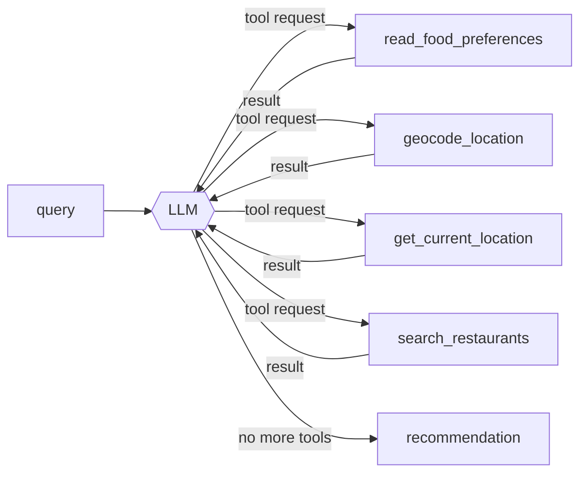

# Restaurant Finder

Agentic search for restaurants near you — a counter to general-web AI search that
increasingly buries local results. The first capability is an **AI restaurant search**:
send a natural-language request and an LLM agent geocodes the location, searches
OpenStreetMap for matching eateries, and writes back a short, human recommendation.

```
POST /api/geo-search/restaurants/{user_id}
{ "query": "quiet sushi in Deep Ellum, Dallas" }

→ "Deep Ellum has a couple of solid quiet sushi options — try Deep Sushi for a
   calm room and fresh nigiri, or …"
```

Everything the agent does is captured as a **telemetry trace** you can query and
replay from a local console (`make trace`) — and the same traces drive a
three-way comparison (`make compare`) between Claude, a raw open-source Qwen,
and that Qwen fine-tuned on Claude's own trajectories.

---

## Quick start (full local stack)

The compose file brings up the API plus every dependency (Postgres, Nominatim,
Overpass, an OSM file server) against a **Dallas** OpenStreetMap extract.

```bash
# 0. install deps
make install                           # uv sync   (make dev-install adds the test group)

# 1. put the Dallas OSM extract in data/  (see scripts/osm_prepare.py + compose.claude.yaml)
#    data/Dallas.osm.pbf and data/Dallas.osm.gz
make osm-convert                       # gz → data/Dallas.osm.bz2 (Overpass import format)

# 2. provide an Anthropic key  (compose.claude.yaml runs LLM_BACKEND=claude;
#    put it in .env or export it — compose reads both)
export ANTHROPIC_API_KEY=sk-ant-...

# 3. bring up the geo services and wait for them to be healthy
make up                                # or: docker compose -f compose.claude.yaml up -d

curl -fsS localhost:9022/health                     # {"status":"healthy"}
curl -s localhost:9022/meta                         # {"backend":"claude","model":"…","mode":"claude",…}
```

> First boot builds the Nominatim and Overpass databases from the extract — that
> takes several minutes and needs headroom (give Docker/Colima ~8 GB RAM).

Then query it:

```bash
curl -sS -X POST localhost:9022/api/geo-search/restaurants/00000000-0000-0000-0000-000000000001 \
  -H 'content-type: application/json' \
  -d '{"query":"date-night Italian in Uptown, Dallas"}'
```

Or use the console — `make trace` — to submit queries and inspect each run.

---

## The API

### `POST /api/geo-search/restaurants/{user_id}`

`user_id` is a UUID used only to load an optional preferences file
(`data/preferences/<user_id>.md` — dietary restrictions, favourite cuisines,
dislikes). It does not need to be unique per person.

Request body (`GeoLocationRestaurantSearchRequest`):

| field | type | notes |
| --- | --- | --- |
| `query` | string, **required** | Natural-language request. Craving, vibe, and any location phrase are read from this text. |
| `session_id` | string | Conversation id → checkpointer `thread_id` for multi-turn. Falls back to `user_id`. |
| `city`, `state` | string | Location override. Coordinates are derived from them. Cannot be combined with `latitude`/`longitude`. |
| `latitude`, `longitude` | float | Explicit coordinate override (both required together). Cannot be combined with `city`/`state`. |
| `radius_m` | int | Starting search radius; a default is applied otherwise. |
| `include_casual` | bool | Widen beyond sit-down restaurants to cafés, fast food, bars, pubs. Default `false`. |

Response: `{ "response": "<recommendation text>" }`.

If no location override is given, the agent extracts and geocodes the location
from the `query` text. **The bundled data is Dallas-only** — queries must
reference Dallas-area places (Deep Ellum, Uptown, Bishop Arts, …).

### `GET /health` → `{"status":"healthy"}`
### `GET /meta` → `{"backend","model","mode","trace_enabled"}` — which model stack is serving requests.

---

## Telemetry console — `make trace`

A small FastAPI app (`scripts/trace_ui.py` + `trace_ui.html`, no extra deps) that
**queries the agent and lets you drill into what happened**. Needs the API
running (`make dev` or docker compose), which is where traces are written.

```bash
make dev                       # terminal 1 — API on :9022, AF_TRACE_DIR set
make trace                     # terminal 2 — console on :7861
```

What it gives you:

- **＋ New run** composer — submit a query; `session_id` auto-fills with a random
  UUID (regenerate with ↻). While the agent runs, the trace streams in live.
- **Runs sidebar** — every past run, grouped by **mode** (`claude` /
  `raw-open-source` / `finetuned-open-source`), each card badged with the model
  it used. Hover for an **×** to delete.
- **Conversation view** — the run rebuilt as numbered steps. Each tool the model
  calls is shown as a round-trip:

  ```
  ① arguments the model generated   →   ② your app runs the tool   →   ③ result handed back
  ```

  Argument values that came straight out of an earlier tool's result are tagged
  `↑ from geocode_location (step 1)`, so the data flow is visible. A collapsible
  primer explains that the model only emits tool *requests* — your app executes
  them.
- **Stats tab** — token bars (input / output / cache), cost estimate, calls per
  run, per-mode aggregates.

### Where traces are saved

Set `AF_TRACE_DIR` on the **API** process and every agent run writes one JSON file:

```
<AF_TRACE_DIR>/<mode>/<YYYYMMDD-HHMMSS>-<trace_id>.json
```

`mode` comes from `AF_TRACE_MODE`, else derived from `LLM_BACKEND`
(`claude` → `claude`, `vllm` → `raw-open-source`, `lora` →
`finetuned-open-source`). Each file holds ordered spans (one per LLM call, one
per tool call) with inputs, outputs, token usage, cost, timing, and the
structured request. `make dev` and `compose.claude.yaml` set `AF_TRACE_DIR`
automatically (`./telemetry/`, git-ignored). Implementation: `src/utils/telemetry.py`.

---

## Architecture

### The agent

A single **deepagents** tool-loop, compiled once at startup
(`src/agents/geo_search/agent.py`), backed by the Postgres checkpointer for
multi-turn state. The system prompt lives in `prompts/restaurant_agent.md` (never
inline in source).



| Tool | Does |
| --- | --- |
| `read_food_preferences` | Reads `data/preferences/<user_id>.md` if present. |
| `geocode_location` | Place phrase → coordinates via **Nominatim**. |
| `get_current_location` | Falls back to `HOME_CITY`/`HOME_STATE` (Dallas, TX) when no location is mentioned. |
| `search_restaurants` | Queries **Overpass** for eateries near `(lat, lon)` within `radius_m`; the model widens the radius and retries when results are sparse (hard cap 16 km, 10 results). |

`src/services/geo_search/restaurants.py` builds the agent input from the request,
runs the loop, and extracts the final assistant message. Tools are
closure-bound to their HTTP clients at compile time — never stored in graph
state (the state is JSON-serialized by the checkpointer).

### Infrastructure

The API is a FastAPI service; every dependency is reached over HTTP at an
**env-configurable URL**, so each can be a local container, an in-cluster
Kubernetes service, or a hosted API without code changes.

```
   natural-language request
             │
             ▼
   ┌──────────────────────┐      ┌───────────┐  place ↔ coords
   │  anything-finder API │────► │ Nominatim │
   │  FastAPI + deepagents│      └───────────┘
   │                      │      ┌───────────┐  nearby OSM eateries
   │                      │────► │  Overpass │
   │                      │      └───────────┘
   │                      │      ┌───────────┐  conversation state
   │                      │────► │ PostgreSQL│  (LangGraph checkpointer)
   │                      │      └───────────┘
   │                      │      ┌───────────┐  inference
   │                      │────► │ LLM backend│  vLLM / Anthropic / LoRA
   └──────────────────────┘      └───────────┘
```

| Component | Purpose | Key env |
| --- | --- | --- |
| **LLM backend** | Inference. See below. | `LLM_BACKEND`, `LLM_MODEL*`, `LLM_BASE_URL`, `ANTHROPIC_API_KEY` |
| **Nominatim** | Forward geocoding (place ↔ coordinates). | `NOMINATIM_BASE_URL`, or `NOMINATIM_USE_EXTERNAL_API` / `NOMINATIM_USE_KUBERNETES_WITH_GEOSEARCH_NAMESPACE` |
| **Overpass** | OpenStreetMap POI queries. | `OVERPASS_BASE_URL`, or the matching `OVERPASS_USE_*` toggles |
| **PostgreSQL** | LangGraph checkpointer — session state, shared across replicas. | `POSTGRES_DSN` |

Because state lives in Postgres, the API is **horizontally scalable** — run
several replicas behind a service; a `session_id` maps to a checkpointer
`thread_id` so multi-turn conversations stay consistent across pods.

### LLM backends

`LLM_BACKEND` selects the provider (`src/utils/llm.py`); all read shared
`LLM_TEMPERATURE`, `LLM_TIMEOUT_SECONDS`, `LLM_MAX_RETRIES` and support per-role
overrides (`LLM_MODEL_AGENT`, `LLM_TEMPERATURE_AGENT`, …).

| `LLM_BACKEND` | Uses | Needs |
| --- | --- | --- |
| `vllm` *(default)* | Self-hosted vLLM / any OpenAI-compatible server. | `LLM_BASE_URL`, `LLM_MODEL` (default a ~7B quantized Qwen for a 16 GB GPU), `LLM_API_KEY` |
| `claude` | Anthropic API (`langchain-anthropic`). | `ANTHROPIC_API_KEY`, `LLM_MODEL_CLAUDE` (default `claude-sonnet-4-6`) |
| `lora` | Same vLLM endpoint with a trained LoRA adapter. | `LLM_MODEL_LORA` (served adapter name, e.g. `af-lora`, or an HF repo path) |

---

## Fine-tuning walkthrough: Claude vs Qwen vs Qwen + LoRA

This section is written for someone who has never fine-tuned a model before.
The question it answers: **how much of Claude's tool-calling behaviour can a
small open model learn from Claude's own trajectories, via LoRA?** Every
command below was run start-to-finish to validate this walkthrough; the
[Troubleshooting](#troubleshooting) subsection at the end documents every real
failure hit along the way and why the fix is what it is — read it before
filing an issue.

**The shape of the experiment:** capture ~400 real agent runs where Claude
solved the restaurant-search task (tool calls, tool results, final answer);
turn those into a supervised fine-tuning (SFT) set; LoRA-train a small
open-weight model (Qwen2.5-7B) on it; then replay the *same* held-out queries
through three backends — Claude, the untouched Qwen, and Qwen+LoRA — and
render a report that shows whether the small model actually learned the
teacher's behaviour.

### What LoRA (and QLoRA) actually do

Skip this if you already know how LoRA works. Everything below uses the
**actual numbers this repo trains with** (`configs/lora/qwen2_5-7b-qlora.yaml`
on `Qwen/Qwen2.5-7B-Instruct`), not a toy example.

**Full fine-tuning** would update every weight matrix in the model directly.
Each of Qwen2.5-7B's 28 decoder layers has 7 such matrices — `q_proj`,
`k_proj`, `v_proj`, `o_proj`, `gate_proj`, `up_proj`, `down_proj` — for a
total of **7.66 billion** parameters. Training all of them means an Adam
optimizer state (a momentum and a variance term per parameter, both usually
kept in fp32) on top of the weights and gradients themselves — three to four
extra copies of a 7.66B-parameter model, which is why full fine-tuning
normally needs multiple large GPUs.

**LoRA** ([Hu et al., 2021](https://arxiv.org/abs/2106.09685)) sidesteps this
by **freezing every original weight matrix** and, for each one you want to
adapt, learning a *low-rank correction* instead of touching the matrix
itself. For a frozen weight `W` (shape `d_out × d_in`), LoRA adds two small
trained matrices:

```
h = W·x  +  (alpha / r) · B·A·x
    ^^^         ^^^^^
  frozen     the only part that trains

  A : r × d_in     (rank r, input-facing)
  B : d_out × r    (rank r, output-facing)
```

`A` and `B` together form a rank-`r` approximation of what a full update to
`W` would look like — `B·A` has shape `d_out × d_in`, same as `W`, but because
it factors through a bottleneck of width `r`, storing and training it costs
only `r·(d_in + d_out)` parameters instead of `d_in·d_out`. `A`'s row count
and `B`'s column count are both exactly `r` — that's the "rank" the name
refers to, and it's the *only* new hyperparameter; everything else about `A`
and `B`'s shape is dictated by the layer they're attached to.

This repo's config sets `lora.r: 16`, `lora.alpha: 32` (so the scaling factor
`alpha/r` above is `2`), and adapts all 7 projection matrices per layer:
`q_proj`, `k_proj`, `v_proj`, `o_proj` from **self-attention**, plus
`gate_proj`, `up_proj`, `down_proj` from the MLP block. Worth being precise
about that first group: **Qwen2.5, like GPT and Llama, is decoder-only — it
has no cross-attention layer anywhere in it.** Cross-attention is specific to
encoder-decoder architectures (the original Transformer, T5, Whisper's
decoder attending over a separate audio encoder), where the query comes from
one stack and the keys/values from another. Every attention layer here is
*causal self-attention*: `q_proj`/`k_proj`/`v_proj`/`o_proj` all read from and
write back to the same sequence.

Qwen2.5-7B uses grouped-query attention, so `k_proj`/`v_proj` are narrower
than `q_proj`/`o_proj` — the table below shows how `A`/`B`'s shapes track each
layer's actual `(d_in, d_out)`, and what fine-tuning that one matrix would
otherwise cost:

| Matrix | Full shape (`d_out × d_in`) | Full params | `A` shape (`r × d_in`) | `B` shape (`d_out × r`) | LoRA params | % of full |
| --- | --- | --- | --- | --- | --- | --- |
| `q_proj`, `o_proj` | 3584 × 3584 | 12,845,056 | 16 × 3584 | 3584 × 16 | 114,688 | 0.89% |
| `k_proj`, `v_proj` | 512 × 3584 | 1,835,008 | 16 × 3584 | 512 × 16 | 65,536 | 3.57% |
| `gate_proj`, `up_proj` | 18944 × 3584 | 67,895,296 | 16 × 3584 | 18944 × 16 | 360,448 | 0.53% |
| `down_proj` | 3584 × 18944 | 67,895,296 | 16 × 18944 | 3584 × 16 | 360,448 | 0.53% |

Not an estimate — this is what's actually sitting in the files. Reading layer
0's weights straight out of the base model's checkpoint and the trained
adapter's `adapter_model.safetensors` gives, key for key (PyTorch's
`nn.Linear` stores weights as `[out_features, in_features]`, so a shape below
reads as `d_out × d_in`):

```
# base model, model.layers[0].self_attn / .mlp   (frozen — no lora_* keys exist for these)
self_attn.q_proj.weight   [3584, 3584]        self_attn.k_proj.weight  [512, 3584]
self_attn.v_proj.weight   [512, 3584]         self_attn.o_proj.weight  [3584, 3584]
mlp.gate_proj.weight      [18944, 3584]       mlp.up_proj.weight       [18944, 3584]
mlp.down_proj.weight      [3584, 18944]

# adapter_model.safetensors, the SAME layer 0 — this is the entire trained delta
self_attn.q_proj.lora_A.weight  [16, 3584]    self_attn.q_proj.lora_B.weight  [3584, 16]
self_attn.k_proj.lora_A.weight  [16, 3584]    self_attn.k_proj.lora_B.weight  [512, 16]
self_attn.v_proj.lora_A.weight  [16, 3584]    self_attn.v_proj.lora_B.weight  [512, 16]
self_attn.o_proj.lora_A.weight  [16, 3584]    self_attn.o_proj.lora_B.weight  [3584, 16]
mlp.gate_proj.lora_A.weight     [16, 3584]    mlp.gate_proj.lora_B.weight     [18944, 16]
mlp.up_proj.lora_A.weight       [16, 3584]    mlp.up_proj.lora_B.weight       [18944, 16]
mlp.down_proj.lora_A.weight     [16, 18944]   mlp.down_proj.lora_B.weight     [3584, 16]
```

Look at `q_proj` specifically: the frozen weight is `[3584, 3584]` — a full
12.8M-parameter, full-rank matrix. `lora_A` is `[16, 3584]` and `lora_B` is
`[3584, 16]` — multiplying them back together, `lora_B @ lora_A`, gives a
`[3584, 3584]` matrix again (same shape the frozen weight has, so it can be
added elementwise) — but because it factors through that 16-wide bottleneck,
it can only ever express a **rank-16** correction, not an arbitrary one, and
it costs 114,688 parameters to store instead of 12,845,056. That gap — same
output shape, a small fraction of the parameters, because the correction is
constrained to be low-rank — is the entire idea LoRA is named after.

Summed across all 7 matrices × 28 layers, that's **40,370,176 trainable
parameters out of 7,655,986,688 total — 0.53%.** (These are the exact numbers
`train_lora.py` prints at the start of every real run via
`model.print_trainable_parameters()` — not an estimate.) The "7,655,986,688
total" is the *entire* 7B model, frozen weights included — it doesn't shrink
or go anywhere; every one of those parameters still runs on every forward
pass, exactly as pretrained. It's only the 40M `lora_A`/`lora_B` values layered
on top that receive gradients and get saved as the adapter. Everything else
about the model — its weights, its knowledge, its general language
ability — never moves, which is why
the whole `configs/lora/qwen2_5-7b-qlora.yaml` run in this walkthrough trains
in minutes on one GPU instead of requiring a multi-GPU cluster.

**QLoRA** ([Dettmers et al., 2023](https://arxiv.org/abs/2305.14314)) is a
second, independent optimization on top of LoRA, and it's easy to conflate
the two — LoRA already made the *trainable* parameter count tiny (0.53%
above), but the *frozen* 7.66B-parameter backbone still has to sit in GPU
memory the whole time just to be read during every forward and backward pass.
At bf16 (2 bytes/param) that's **~15.3 GB** for the frozen weights alone,
before any activations, gradients, or the LoRA matrices themselves — tight on
a 16 GB GPU, impossible on smaller ones. QLoRA's contribution is entirely
about that frozen half:

- **4-bit NF4 quantization of the frozen weights.** `bnb_4bit_quant_type: nf4`
  in this repo's config stores each frozen weight in ~4 bits using a data
  type (NormalFloat4) shaped for how pretrained neural network weights are
  actually distributed — clustered near zero, roughly Gaussian — rather than
  a generic uniform 4-bit integer. This alone drops the frozen backbone from
  ~15.3 GB to **~3.8 GB**.
- **Dequantize-on-the-fly, not "train in 4-bit."** The 4-bit weights are never
  used directly in a matmul — right before each forward/backward pass touches
  a frozen matrix, it's expanded back to bf16 in-memory, used, and discarded.
  The LoRA `A`/`B` matrices themselves are ordinary bf16 tensors with real
  gradients throughout — QLoRA never touches how *they* train, only how the
  frozen weights sit in memory between uses.
- **Double quantization** (`bnb_4bit_use_double_quant: true`) — even the small
  per-block scale factors the 4-bit scheme needs are themselves quantized,
  saving a further ~0.4 bits/parameter on top of the above.
- **Paged optimizers** (`optim: paged_adamw_8bit` in this repo's training
  config) spill optimizer state to CPU RAM under memory pressure — like OS
  virtual-memory paging — so a batch-size spike degrades speed instead of
  crashing with an out-of-memory error.

So: **LoRA decides what gets trained (0.53% of the model); QLoRA decides how
cheaply the other 99.47% can sit in memory while that happens.** They compose
because they solve different problems — this is exactly why
`configs/lora/qwen2_5-7b-qlora.yaml` sets *both* `lora.r: 16` *and*
`load_in_4bit: true`. It's also why the A100 variant,
`configs/lora/qwen2_5-7b-lora-a100.yaml`, turns `load_in_4bit` **off**: an
A100 has enough VRAM to hold the frozen weights in plain bf16, so it skips
QLoRA's quantize/dequantize overhead entirely and trains faster — while
keeping `lora.r: 16` unchanged, because LoRA's parameter savings are worth
keeping regardless of how much VRAM you have.

### Prerequisites

| What | Why | Where to get it |
| --- | --- | --- |
| An Anthropic API key | Captures the teacher trajectories. | `ANTHROPIC_API_KEY` in `.env` |
| A CUDA GPU box, ≥16 GB VRAM | Training needs CUDA; a Mac (arm64) or CPU-only box cannot run it. This repo trains on a rented [brev.dev](https://brev.dev) box, but any SSH-reachable CUDA machine works the same way. | `brev ls` if using brev.dev, or your own box's SSH details |
| A Hugging Face account + write token | Publishes the finished adapter. Optional — training works without it, you just won't get a shareable repo. | `HF_TOKEN` in `.env`, from [huggingface.co/settings/tokens](https://huggingface.co/settings/tokens) |
| Docker or Colima, ~8 GB RAM headroom | Runs the local geo stack (Nominatim + Overpass) the agent needs for every capture. | Already on most dev machines |

**GPU driver check — do this before anything else.** The exact CUDA version
your GPU box's driver supports determines which `torch` build will actually
run on it, and getting this wrong is the single most common way this whole
pipeline breaks. SSH in and check:

```bash
ssh <your-gpu-box> nvidia-smi
```

Look at the top-right of the header line: `CUDA Version: 12.2` (for example).
That is the **maximum** CUDA *runtime* the driver supports — not the CUDA
toolkit installed, and unrelated to what `torch` you happen to `pip install`.
`pyproject.toml`'s `training` dependency group already pins `torch` to a
CUDA-12.1 build for exactly this reason (see the comment right above it) —
if your box reports `CUDA Version: 12.2` or lower, you need nothing further,
the pin already fits. If it reports `12.4` or higher, you *can* drop to the
newer default PyPI wheels for a modest speed bump, but the pinned build works
regardless — a lower-CUDA wheel always runs on a newer driver, never the other
way around, so there is no reason to change anything unless you want the
extra performance.

### Step 0 — clone, install, configure

```bash
git clone <this-repo> && cd anything-finder
make install                   # uv sync — creates .venv, installs runtime deps
cp .env.example .env
```

Edit `.env` and fill in at minimum:

```bash
ANTHROPIC_API_KEY=sk-ant-...
HF_TOKEN=hf_...
HF_REPO=<you>/restaurant-finder-qwen25-7b-lora
BREV_HOST=<your-gpu-box-ssh-alias>
BREV_DIR=anything-finder        # remote checkout path — created for you, no need to pre-create
LORA_CONFIG=configs/lora/qwen2_5-7b-qlora.yaml
```

**Every `make` target that needs `BREV_HOST`/`HF_REPO`/`LORA_CONFIG` reads
them as plain shell variables, not from `.env` directly** — so after editing
`.env`, export it into your current shell before running anything:

```bash
set -a; source .env; set +a
```

Do this once per new terminal tab/session — it does not persist automatically.

### Step 1 — bring up the local geo stack

The agent needs Nominatim (geocoding) and Overpass (POI search) reachable to
run at all, even during data capture.

```bash
make up
```

First boot imports a Dallas OpenStreetMap extract into both services and can
take **up to 10 minutes** — the target polls until both report healthy and
prints `geo stack ready.` before returning. Subsequent runs are near-instant
(the data persists in a local volume). If it ever reports "still not healthy"
after the full wait, see [Troubleshooting](#troubleshooting).

### Step 2 — build the training set from Claude's own trajectories

```bash
make data
```

This chains three steps and should print something close to:

```
wrote 333 -> data/lora/train.jsonl
wrote  37 -> data/lora/val.jsonl
tool schemas (4): read_food_preferences, get_current_location, geocode_location, search_restaurants
```

What happened, in order:

1. `gen_eval_queries.py` writes 200 deterministic Dallas food queries with
   ground-truth `target_neighborhood` / `target_cuisine` / `target_vibe`
   labels to `data/eval/dallas_food_queries.csv`.
2. `run_eval_queries.py` runs each one through the **real agent**, with Claude
   as the LLM, against your local Nominatim/Overpass. This calls the
   Anthropic API ~200 times — expect it to take a while and to cost a few
   dollars. It writes `data/eval/dallas_food_runs.jsonl`, one row per query,
   including the full tool-call transcript.
3. `prepare_lora_data.py` turns those transcripts into a chat-format SFT
   set — `data/lora/train.jsonl` / `val.jsonl` — dropping rows with an error
   (a query that failed to geocode, etc.). Only the `transcript` field is
   trusted; the flat `messages`/`prompt`/`completion` fields on each row
   collapse a whole multi-turn trajectory into a single assistant turn and
   are not usable for training. See `src/training/dataset.py`.

Already have a captured dataset (e.g. from git) and just want the SFT files?
Skip straight to `make lora-data`, step 3 alone.

### Step 3 — sanity-check the data pipeline with no GPU

Before spending any GPU time, confirm the tokenizer, chat template, and
assistant-only masking are all doing the right thing:

```bash
make lora-smoke
```

This downloads a tiny model (`Qwen/Qwen3-0.6B`, a few hundred MB) and prints
one fully-rendered training example with masked spans marked `·` — system
prompt, user turns, and tool *results* should all be masked (the model isn't
trained to predict those), while every assistant turn (including tool-call
JSON) should be unmasked. If a whole conversation shows as unmasked or a whole
conversation shows as masked, something is wrong with the data — stop here,
don't proceed to a real training run.

### Step 4 — train the LoRA adapter on the GPU box

```bash
make lora-train-remote
```

(`BREV_HOST`, `HF_REPO`, and `LORA_CONFIG` all come from the `.env` you sourced
in Step 0 — no need to repeat them on the command line unless you want to
override one for this run, e.g. `make lora-train-remote LORA_CONFIG=configs/lora/qwen3_8-27b-qlora.yaml`.)

This does the following, and returns almost immediately (training continues
in the background on the box, detached from your SSH session so it survives a
dropped connection or a closed laptop lid):

1. `rsync`s the repo to the box (excluding the OSM blobs, `.venv`, and scratch
   telemetry — see `scripts/brev_train.sh`).
2. Runs `scripts/brev_setup.sh` on first use: checks for an NVIDIA GPU, then
   `uv sync --group training` — this is the step that pulls in the
   CUDA-12.1-pinned `torch`/`vllm`/`transformers` stack from Step 0's driver
   check.
3. Launches `make lora-train` under `nohup` on the box.

Watch it train:

```bash
make lora-logs                 # tail the raw training log — loss every 5 steps
```

```bash
make lora-tensorboard          # graphical loss dashboard, updates live
ssh -N -L 6006:localhost:6006 $BREV_HOST &
open http://localhost:6006
```

`make lora-tensorboard` starts TensorBoard on the box pointed at the run's own
log directory; the tunnel forwards it to your machine. It polls its event
files every ~30s, so it's safe to open at any point after training starts —
`make lora-tensorboard-stop` when you're done with it (it doesn't interfere
with training either way). What "going well" looks like: `train/loss` drops
steadily over the first epoch and flattens by the last one; `eval/loss`
should track `train/loss` rather than climb away from it (that would mean
overfitting the small validation set).

For the default config (`configs/lora/qwen2_5-7b-qlora.yaml`, 333 training
rows, 3 epochs), expect **~10–20 minutes** of actual training compute on a
16–24 GB GPU (A10G/L4-class), plus a one-time ~5–10 minute setup cost on a
fresh box (dependency install + base model download). On the training run
finishing you should see a line like:

```
{'train_loss': 0.53..., 'epoch': 3.0}
pushed -> <you>/restaurant-finder-qwen25-7b-lora
```

That last line only appears because `HF_REPO` was set — see the next section.

### Step 5 — the adapter is now on Hugging Face

Setting `HF_REPO` on the training command pushes the finished adapter
automatically, along with a model card generated from the resolved config
(`src/training/model_card.py`: base model, data provenance, hyperparameters,
the assistant-only-masking and `enable_thinking: false` caveats, and the exact
vLLM serve command to reproduce it). Already have a finished run and just want
to publish it (no GPU, no retraining)?

```bash
make lora-push HF_REPO=<you>/<repo-name>
uv run scripts/push_lora.py --repo <you>/<repo-name> --dry-run   # render the card, upload nothing
```

Want the adapter files locally too (e.g. to commit `data/lora/runs/` or
inspect it) — this is optional, the Hub copy is already the source of truth:

```bash
make lora-fetch
```

### Step 6 — serve the base model and the adapter together

```bash
make vllm-remote LORA_DIR=data/lora/runs/qwen25-7b-restaurant-react-lora
```

One vLLM process serves **both** the base model and the LoRA adapter
simultaneously (`--enable-lora --lora-modules af-lora=...`) — you don't need
to relaunch it to switch between "before" and "after" comparisons. Open a
tunnel and verify:

```bash
ssh -N -L 8000:localhost:8000 $BREV_HOST &
curl -H "Authorization: Bearer EMPTY" http://localhost:8000/v1/models
```

You should see **two** entries: the base model id and `af-lora`. (The
`Authorization: Bearer EMPTY` header is required even though the API key
*value* is the literal string `EMPTY` — vLLM still checks for the header.)
`make vllm-stop` when you're done with it — training and serving can't share
the GPU at the same time, so stop one before starting the other.

### Step 7 — replay the same queries through all three backends

```bash
make compare-run COMPARE_LIMIT=25
```

This runs three targets in sequence, each replaying the **same** first
`COMPARE_LIMIT` rows of the eval CSV (deterministic file order, so `--limit N`
is identical across all three — that's what makes it a comparison and not
three unrelated samples) with `AF_TRACE_DIR` set, so every run leaves a full
telemetry trace:

| Target | `LLM_BACKEND` | trace mode | writes |
| --- | --- | --- | --- |
| `compare-run-sonnet` | `claude` | `claude/` | `data/eval/runs/claude.jsonl` |
| `compare-run-qwen` | `vllm` | `raw-open-source/` | `data/eval/runs/raw-open-source.jsonl` |
| `compare-run-lora` | `lora` | `finetuned-open-source/` | `data/eval/runs/finetuned-open-source.jsonl` |

(Run one at a time with `make compare-run-sonnet` / `compare-run-qwen` /
`compare-run-lora` if you want to inspect each independently.) Student
captures deliberately avoid `data/eval/*_runs.jsonl`, which
`prepare_lora_data.py` globs for the teacher's SFT set — mixing them would let
the student's own (possibly wrong) output leak into future training data.

### Step 8 — build the report

```bash
make traces-freeze             # telemetry/ -> committed data/traces/<mode>.jsonl.gz
make compare                   # -> data/compare/report.html, opens automatically
```

One self-contained HTML file: no server, no CDN, no network fetch — it opens
from disk and can be attached to a PR or a Slack message as-is.

- **Leaderboard** — per mode: runs, error rate, LLM calls / run, tools / run,
  tokens / run, p50 latency, estimated cost, plus two behavioural rates —
  *grounded* (resolved a location before searching) and *named area* (the
  answer mentions the query's target neighbourhood). Best/worst per column
  tinted; below it, the distribution of tool paths each mode actually took.
- **Side by side** — pick a query, get one column per mode: the final
  recommendation, the tool chain with divergent steps highlighted, a token /
  latency / cost strip, pass/fail flags, and two dropdowns per result — **full
  trace** (the numbered-step conversation view) and **raw JSON** (the exact
  object every stat on the card was computed from).
- By default the report only shows queries **every mode actually attempted**
  (`--common-run-only`, on by default) — a query only claude happened to run
  never shows as a blank column for the others. Pass `--no-common-run-only` to
  see every row a single mode touched, `--common-success-only` to additionally
  hide rows where any mode errored, or `--max-queries N` to cap the row count;
  all three go through `make compare ARGS="..."`.
- `--modes claude` or `--modes claude,raw-open-source` restricts the report to
  a subset — a single-column report, or a head-to-head without the third mode.
  Useful for a presentation that wants to build up the comparison one model at
  a time — `make compare ARGS="--modes claude --max-queries 25 --out
  data/compare/report-claude.html"`, then add `--modes claude,raw-open-source`
  for a second file, then the full three-way. `--max-queries 25` on every
  invocation keeps the query set identical across all of them (the eval CSV's
  file order is deterministic, so the same `N` always selects the same rows).

`make traces-freeze` packs the scratch `telemetry/` tree into committed
`data/traces/<mode>.jsonl.gz` bundles (merging, not clobbering) — that's what
makes the report reproducible from a fresh clone with no GPU and no API key;
`make compare` reads either the live tree or the frozen bundles.

### What is committed

`.gitignore` allow-lists the experiment's record and keeps the blobs out:
`data/eval/*.csv` + `*.jsonl`, `data/lora/{train,val}.jsonl`,
`data/traces/*.jsonl.gz`, and `data/compare/report.html` are tracked; the
47–114 MB OSM extracts, the scratch `telemetry/` tree, and trained adapters
(`data/lora/runs/`, which live on the Hub) are not.

### Serving the adapter in the live app

Uncomment the `vllm` service in `compose.claude.yaml`, or point
`LLM_BASE_URL` at the box from `make vllm-remote`. Then
`LLM_BACKEND=lora LLM_MODEL_LORA=af-lora LLM_BASE_URL=…`; `GET /meta` reports
`{"backend":"lora","mode":"finetuned-open-source"}` and `make trace` files the
run under `finetuned-open-source/`.

### Which LoRA config to use

| Config | Base model | GPU need | Notes |
| --- | --- | --- | --- |
| `configs/lora/qwen2_5-7b-qlora.yaml` *(default)* | `Qwen/Qwen2.5-7B-Instruct`, 4-bit QLoRA | 16 GB+ | Same model family as the raw baseline (`Qwen/Qwen2.5-7B-Instruct-AWQ`), so the report's "base" and "+ LoRA" columns differ only by the adapter. |
| `configs/lora/qwen2_5-7b-lora-a100.yaml` | Same base, full bf16, no quantization | 24–40 GB | 2–4x faster wall-clock on an A100 — quantization overhead removed, bigger batches. Trains against the *true* bf16 weights the adapter will actually be served on top of, not a quantized approximation. See the comments in the file for the reasoning. |
| `configs/lora/qwen3_8-27b-qlora.yaml` | `Qwen/Qwen3.8-27B`, 4-bit QLoRA | 48 GB+ | The bigger run. Trains on the BF16 repo (FP8 block-quantized weights can't be back-propagated through) and keeps the vision tower frozen via `lora.exclude_modules`. |
| `configs/lora/smoke.yaml` | `Qwen/Qwen3-0.6B` | none (`--dry-run`) or minutes on CPU | Pipeline validation only — see Step 3. |

Select one with `LORA_CONFIG=configs/lora/<file>.yaml` in `.env` (re-source
your shell after changing it) — every `lora-*` target derives its run name
from whichever config is currently set, so keep it consistent across a whole
training → serving → capture cycle.

### Troubleshooting

Every one of these was hit and fixed while building this pipeline; the fixes
are already baked into the repo, so following the steps above in order should
not reproduce them. This table exists so that if something *does* go wrong —
a different GPU box, a customized command, an upstream version bump — you
recognize the failure immediately instead of debugging from scratch.

| Symptom | Cause | Fix |
| --- | --- | --- |
| `make up`'s health check spins for the full wait and then fails, even though the stack looks fine in `docker compose ps` | (Historical, already fixed in the Makefile.) The health-check `curl` hit Overpass's `data=[out:json]` URL without `-g`; curl's own URL-globbing treats `[...]` as a range expression and fails the request before it's even sent, every single poll. | Already fixed (`curl -sfg …`). If you see this again, add `-g` to any hand-rolled curl call against an Overpass-shaped URL. |
| `AssertionError: CUDA not visible to torch` right after `uv sync --group training` on the GPU box | `torch`'s default (unpinned) PyPI wheel now bundles CUDA 13 runtime libs, which a driver reporting `CUDA Version: 12.2` (or lower) in `nvidia-smi` cannot run — CUDA minor-version compatibility does not extend across major versions. | Already pinned in `pyproject.toml` (`torch`/`torchvision`/`torchaudio` all sourced from the `pytorch-cu121` index). If you changed that pin, revert it or match it to your box's actual driver (see the Prerequisites GPU check above). |
| `vllm: command not found` / `ModuleNotFoundError: No module named 'vllm'` | `vllm` wasn't declared as a dependency at all. | Already added to the `training` group. |
| `ModuleNotFoundError: Could not import module 'ProcessorMixin'` when `vllm serve` starts | An unpinned `transformers` resolves to its newest release, whose breaking changes an older `vllm` (pinned to match the CUDA-12.1 `torch` build) can't import against. | Already capped (`transformers>=4.45,<5`). |
| `"auto" tool choice requires --enable-auto-tool-choice and --tool-call-parser to be set` (a 400 from vLLM on every single request) | The agent always sends `tool_choice="auto"`; vLLM refuses that unless launched with matching flags. | Already baked into `scripts/brev_serve.sh` (`--enable-auto-tool-choice --tool-call-parser hermes` — `hermes` because Qwen's chat template renders tool calls in the Hermes `<tool_call>` format). If you ever hand-roll a `vllm serve` command, include both flags. |
| The fine-tuned model's answers contain literal `<tool_call>` text instead of a clean recommendation, sometimes with malformed JSON like `{"name": "...", "{}": "{}"}` | `src/training/dataset.py` used to pre-serialize tool-call `arguments` into a JSON **string** (`json.dumps(...)`) — correct for the OpenAI wire format, but Qwen's own chat template applies its own JSON serialization when rendering a `<tool_call>` block. Handing it an already-stringified value double-encodes it, so the actual training text the model learned from had `"arguments": "{}"` (a quoted string) instead of `"arguments": {}` (a raw object) — off-distribution from anything the base model was pretrained on, and the LoRA generalized that malformation at inference. | Already fixed: `arguments` is now passed as a raw object, matching what the template's own instructions specify (`<args-json-object>`, not a string). If you're extending `dataset.py`, remember this rule: **hand the chat template raw Python objects, let it serialize them — never pre-serialize a field the template will serialize again.** |
| `AnthropicInvalidRequestError: Error code: 400 - ... 'temperature is deprecated for this model'` when capturing Claude data | Newer Claude models (Sonnet 5+) reject the `temperature` parameter outright. `src/utils/llm.py` already has logic to omit it when unset — but `.env`/`.env.example` used to set `LLM_TEMPERATURE` unconditionally, forcing it through regardless. | Already commented out in both files. Leave `LLM_TEMPERATURE` unset for the `claude` backend; the `vllm`/`lora` backends still get a sane 0.2 default even when it's unset. |
| A remote `ssh`/`rsync` command hangs for 30–120 seconds then eventually succeeds, or fails outright, right after a previous SSH session touched the same box | A stale multiplexed connection (`ControlMaster`/`ControlPersist` in `~/.brev/ssh_config` or your own SSH config) — the socket file exists but its master process died, so new connections queue behind a dead handle before falling back. | `rm -f ~/.ssh/brev-control-*` (or wherever your `ControlPath` points), then retry — the next connection establishes a fresh master. Harmless to run any time. |
| `make vllm-remote` / `make lora-train-remote` launches something that dies instantly with an empty log, no error visible | The launched process was still attached to the SSH session that started it; a connection blip (see above) killed it before it could fully detach, even with `nohup`. | `scripts/brev_serve.sh` / `brev_train.sh` already detach fully (`setsid ... < /dev/null & disown`). Re-run the command after resetting the SSH connection as above. |
| Training and serving can't both fit on the GPU / one silently evicts the other | A single GPU can't hold vLLM's KV cache reservation *and* run training at the same time — vLLM defaults to reserving 90% of VRAM up front. | `make vllm-stop` before `make lora-train-remote`, and vice versa. Check `ssh $BREV_HOST nvidia-smi` to confirm `0 MiB` used before starting the other. |
| `curl .../v1/models` (or any vLLM request) returns `{"error":"Unauthorized"}` even with `--api-key EMPTY` on the server | vLLM's `--api-key EMPTY` still means "check for a matching `Authorization` header," not "skip the check." | Send `-H "Authorization: Bearer EMPTY"` on every request — `run_eval_queries.py` already does this via `LLM_API_KEY`. |

---

## Local development

Dependencies are managed with **[uv](https://docs.astral.sh/uv/)** (`uv.lock` is
the lockfile; `pyproject.toml` holds the deps and the `dev` dependency-group).

```bash
make install                  # uv sync — create .venv and install runtime deps
make dev-install              # uv sync --group dev — adds the test stack
cp .env.example .env          # then edit for your setup

make dev                      # uvicorn --reload on 127.0.0.1:9022 (AF_TRACE_DIR=telemetry)
make test                     # uv run pytest
# or: uv run python -m src.main

uv add "some-package>=1.2"     # add a runtime dep
```

Config is entirely environment-driven; `.env.example` documents every variable.
`make dev` reads a sourced `.env`; `docker compose` picks up `.env` automatically.
The ones you'll touch first: `LLM_BACKEND` (+ its credentials), `POSTGRES_DSN`,
`NOMINATIM_*` / `OVERPASS_*`.

### Tests

The default suite is **hermetic** — it stubs the LLM, mocks HTTP
(`pytest-httpx`), and uses an in-memory checkpointer, so it needs no GPU,
database, or network:

```bash
uv run pytest                 # everything except @pytest.mark.live
uv run pytest -m live         # opt-in: requires a real LLM endpoint + Postgres
```

`tests/unit/` mirrors `src/` (and `tests/unit/scripts/` covers the console);
`tests/regression/` holds schema-stability guards.

---

## Container & deployment

The image is built from **`containerfile`** — multistage, `uv sync --frozen`,
non-root user, `CMD` runs `uvicorn src.main:app` on `0.0.0.0:9022`.

```bash
docker build -t anything-finder -f containerfile .      # or: podman build
docker run --env-file .env -p 9022:9022 anything-finder
```

- **`compose.claude.yaml`** — the full local stack (API + Postgres + Nominatim +
  Overpass + OSM file server). A `.dockerignore` keeps the host `.venv`, `data/`,
  and `telemetry/` out of the build context.
- **`charts/anything-finder/`** — Helm chart with phased `values-*.yaml` for a
  self-hosted Kubernetes deployment (default dependency URLs resolve
  `*.svc.cluster.local`).
- Optional GPU **vLLM** service is scaffolded (commented) in the compose file.

---

## Repo layout

```
src/
  main.py                       FastAPI app, lifespan, /health, /meta
  routers/geo_search/           HTTP endpoint
  services/geo_search/          per-request orchestration (builds agent input, runs the loop)
  agents/geo_search/
    agent.py                    build_restaurant_agent — the deepagents loop
    tools.py                    the 4 tool factories
  utils/
    llm.py                      make_llm — backend selection + per-role models
    nominatim.py  overpass.py   HTTP client factories + query helpers
    prompts.py                  load_prompt — markdown prompt loader
    telemetry.py                JsonFileTracer + run_config — per-run trace capture
  schemas/geo_search/           request / response models
  training/                     torch-free LoRA pipeline: config, dataset, tool_schemas,
                                masking, model_card, hub
prompts/restaurant_agent.md     the agent's system prompt
scripts/
  ui_common.css  ui_common.js   shared styling + the conversation renderer (inlined by both UIs)
  trace_ui.py  trace_ui.html    the live telemetry console (make trace)
  build_compare_report.py       joins traces + runs + labels -> report.html (make compare)
  compare_report.html           the report template
  freeze_traces.py              telemetry/ -> data/traces/*.jsonl.gz (make traces-freeze)
  gen_eval_queries.py           the synthetic Dallas query set (make eval-queries)
  run_eval_queries.py           replay the eval set on any backend, traced (make compare-run)
  osm_prepare.py                OSM file server used by compose
  prepare_lora_data.py          transcripts -> data/lora/{train,val}.jsonl (make lora-data)
  train_lora.py                 PEFT + TRL trainer, --dry-run (make lora-train / lora-smoke)
  push_lora.py                  publish a finished adapter + card to HF (make lora-push)
  brev_setup.sh                 one-command brev.dev GPU bootstrap
  brev_train.sh  brev_serve.sh  remote training / vLLM launch (make lora-train-remote, vllm-remote)
  brev_tensorboard.sh           live loss dashboard on the GPU box (make lora-tensorboard)
  sync_pyproject.py             legacy pyproject sync helper
data/
  eval/                         query set + captured runs per mode        (committed)
  lora/                         train.jsonl, val.jsonl, tool_schemas.json (committed)
  traces/                       frozen telemetry bundles                  (committed)
  compare/report.html           the generated comparison report           (committed)
configs/lora/                   qwen2_5-7b-qlora.yaml (default), qwen2_5-7b-lora-a100.yaml,
                                qwen3_8-27b-qlora.yaml (bigger run), smoke.yaml (pipeline check)
charts/anything-finder/         Helm chart
compose.claude.yaml             full local stack
containerfile                   app image
```
